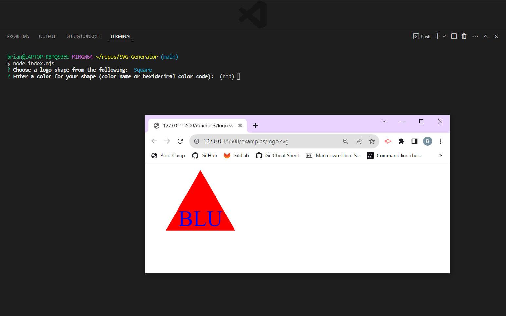

# <Your-Project-Title>

## Description

In order to make creating logos quicker and easier, I've put together this SVG generator which will overlay text to a simple shape, and allow the user to enter their own colors based on prompts. This project uses JavaScript classes to make processing the user input more simple, as all functions are held within a "shape" class, and inherited by the "circle", "square", and "triangle" classes when generating the svg code. 

## Installation

Open the project in your preferred coding software and run "npm i" in the terminal. This will also install Jest and Babel for testing purposes.

## Usage

Run index.mjs in the terminal.

Choose your preferred shape and then enter your preferred color.

Enter your text (up to 3 characters), and then enter your preferred color. 

Once you choose a text color, your SVG will be output to logo.svg in the "examples" folder.

Example video - https://drive.google.com/file/d/1bSmK880u5RWIGK6YD8NofT6GeKTsXrPE/view